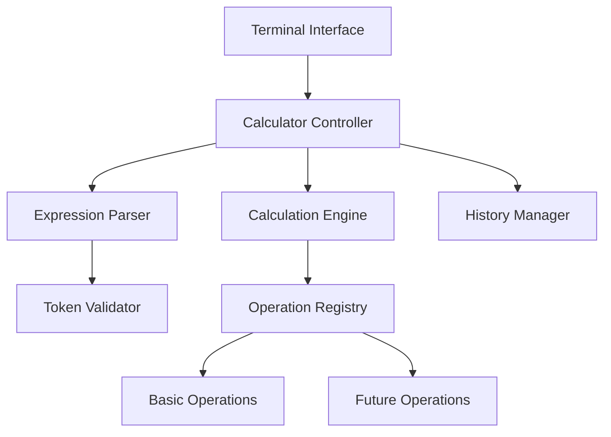

# Design Document

## Overview

The terminal calculator is designed as a modular, extensible Python application that separates concerns between user interface, expression parsing, calculation logic, and history management. The architecture follows SOLID principles and Python best practices to enable easy addition of new mathematical operations and future interface types (GUI, web) without major restructuring.

The system uses a layered architecture implemented through Python modules and classes, where the core calculation engine is completely independent of the terminal interface. This design allows for future extensibility while maintaining clean separation of responsibilities. The application is optimized for Python 3.8+ and tested on macOS.

## Architecture

The calculator follows a layered architecture implemented through Python modules with clear separation between:

1. **Interface Layer** (`ui/` module): Handles user input/output and terminal-specific operations using Python's built-in `input()` and `print()` functions
2. **Application Layer** (`app/` module): Orchestrates the flow between components and manages application state
3. **Domain Layer** (`domain/` module): Contains core business logic for expression parsing and calculation using Python's `ast` module for safe evaluation
4. **Infrastructure Layer** (`infrastructure/` module): Handles history storage using Python's built-in data structures and file I/O

### High-Level Component Interaction



## Components and Interfaces

### 1. Terminal Interface (`ui/terminal_interface.py`)

**Responsibility**: Handle all terminal-specific input/output operations using Python's built-in I/O functions

**Key Methods**:
- `display_welcome()`: Shows welcome message and usage instructions using `print()`
- `prompt_for_input()`: Gets user input using `input()` with appropriate prompting
- `display_result(result)`: Shows calculation results with proper formatting
- `display_error(message)`: Shows user-friendly error messages
- `display_history(calculations)`: Shows formatted calculation history
- `handle_keyboard_interrupt()`: Gracefully handles Ctrl+C on macOS

**Design Rationale**: Isolating terminal operations allows easy replacement with other interfaces (tkinter GUI, Flask web) without affecting core logic. Uses Python naming conventions (snake_case).

### 2. Calculator Controller (`app/calculator_controller.py`)

**Responsibility**: Orchestrate the main application flow and coordinate between components

**Key Methods**:
- `start()`: Initialize and run the main calculator loop with proper exception handling
- `process_input(user_input)`: Handle user commands and expressions
- `shutdown()`: Clean up resources and exit gracefully
- `handle_signal(signum, frame)`: Handle system signals (SIGINT) on macOS

**Design Rationale**: Acts as the application's entry point and coordinates all other components, implementing the main control flow. Includes macOS-specific signal handling for graceful shutdown.
#
### 3. Expression Parser (`domain/expression_parser.py`)

**Responsibility**: Parse mathematical expressions into evaluable tokens and validate syntax using Python's `ast` module for safe evaluation

**Key Methods**:
- `parse(expression)`: Convert string expression into AST nodes using `ast.parse()`
- `validate_syntax(expression)`: Check for syntax errors using `ast` compilation
- `handle_parentheses(expression)`: Process parentheses grouping leveraging Python's built-in parsing
- `sanitize_input(expression)`: Remove unsafe operations and validate allowed characters

**Design Rationale**: Uses Python's built-in `ast` module for safe expression parsing, avoiding `eval()` security risks. Separating parsing from calculation allows for different expression formats and easier testing of parsing logic independently.

### 4. Calculation Engine (`domain/calculation_engine.py`)

**Responsibility**: Execute mathematical operations on parsed expressions using safe evaluation

**Key Methods**:
- `evaluate(ast_node)`: Calculate result from parsed AST using custom node visitor
- `execute_operation(operator, operands)`: Perform specific mathematical operations
- `visit_binop(node)`: Handle binary operations (add, subtract, multiply, divide)
- `visit_unaryop(node)`: Handle unary operations (negative numbers)

**Design Rationale**: Core calculation logic is isolated using Python's AST visitor pattern to enable safe evaluation without `eval()`. This design enables easy testing and future extension with new operations while maintaining security.

### 5. Operation Registry (`domain/operation_registry.py`)

**Responsibility**: Manage available mathematical operations in a plugin-like structure using Python dictionaries and decorators

**Key Methods**:
- `register_operation(symbol, handler)`: Add new mathematical operations using decorator pattern
- `get_operation(symbol)`: Retrieve operation handler by symbol from registry dict
- `get_supported_operations()`: List all available operations
- `@operation` decorator: Decorator for registering new operations

**Design Rationale**: Plugin architecture using Python decorators and dictionaries allows easy addition of new operations without modifying existing code, supporting requirement 5. Follows Python conventions for extensible systems.

### 6. History Manager (`infrastructure/history_manager.py`)

**Responsibility**: Store and retrieve calculation history with size limits using Python collections

**Key Methods**:
- `add_calculation(expression, result)`: Store a calculation in history using `collections.deque`
- `get_history()`: Retrieve recent calculations (last 10) as list
- `clear_history()`: Reset calculation history
- `save_to_file()`: Optional persistence to file (macOS compatible paths)
- `load_from_file()`: Optional loading from file

**Design Rationale**: Uses `collections.deque` with maxlen for efficient FIFO history management. Separate history management enables different storage strategies and easy testing of history functionality. File operations use macOS-compatible path handling.

## Data Models

### Expression Token (using dataclass)
```python
from dataclasses import dataclass
from typing import Union, Literal

@dataclass
class ExpressionToken:
    type: Literal['number', 'operator', 'parenthesis']
    value: Union[str, float]
    position: int
```

### Calculation Record (using dataclass)
```python
from dataclasses import dataclass
from datetime import datetime

@dataclass
class CalculationRecord:
    expression: str
    result: float
    timestamp: datetime
```

### Operation Handler (using Protocol for type hints)
```python
from typing import Protocol, Callable

class OperationHandler(Protocol):
    symbol: str
    precedence: int
    execute: Callable[[float, float], float]
```

## Error Handling

The system implements comprehensive error handling using Python's exception system to provide user-friendly feedback:

1. **Syntax Errors**: Invalid expressions, mismatched parentheses (caught from `ast.parse()`)
2. **Mathematical Errors**: Division by zero (`ZeroDivisionError`), invalid operations
3. **Input Errors**: Unsupported characters, empty expressions
4. **System Errors**: Keyboard interrupts (`KeyboardInterrupt`), file I/O errors on macOS

**Error Strategy**: All errors are caught at the controller level using try-except blocks and converted to user-friendly messages without exposing technical details or stack traces (requirement 4). Custom exception classes inherit from built-in Python exceptions for proper error hierarchy.

## Testing Strategy

The modular design enables comprehensive unit testing using Python's `unittest` framework and `pytest`:

1. **Component Testing**: Each component can be tested in isolation using mock objects
2. **Integration Testing**: Test component interactions through the controller
3. **End-to-End Testing**: Test complete user workflows using `io.StringIO` for input/output simulation
4. **Platform Testing**: Specific tests for macOS Terminal compatibility and signal handling

**Test Coverage Areas**:
- Expression parsing with various input formats using `ast` module
- Mathematical operations including edge cases (division by zero, large numbers)
- Error handling and user feedback with custom exception testing
- History management using `collections.deque` and storage limits
- Parentheses handling and operator precedence
- macOS-specific functionality (signal handling, file paths)

**Testing Tools**:
- `unittest` for basic test structure
- `pytest` for advanced testing features and fixtures
- `unittest.mock` for mocking dependencies
- `io.StringIO` for testing input/output operations